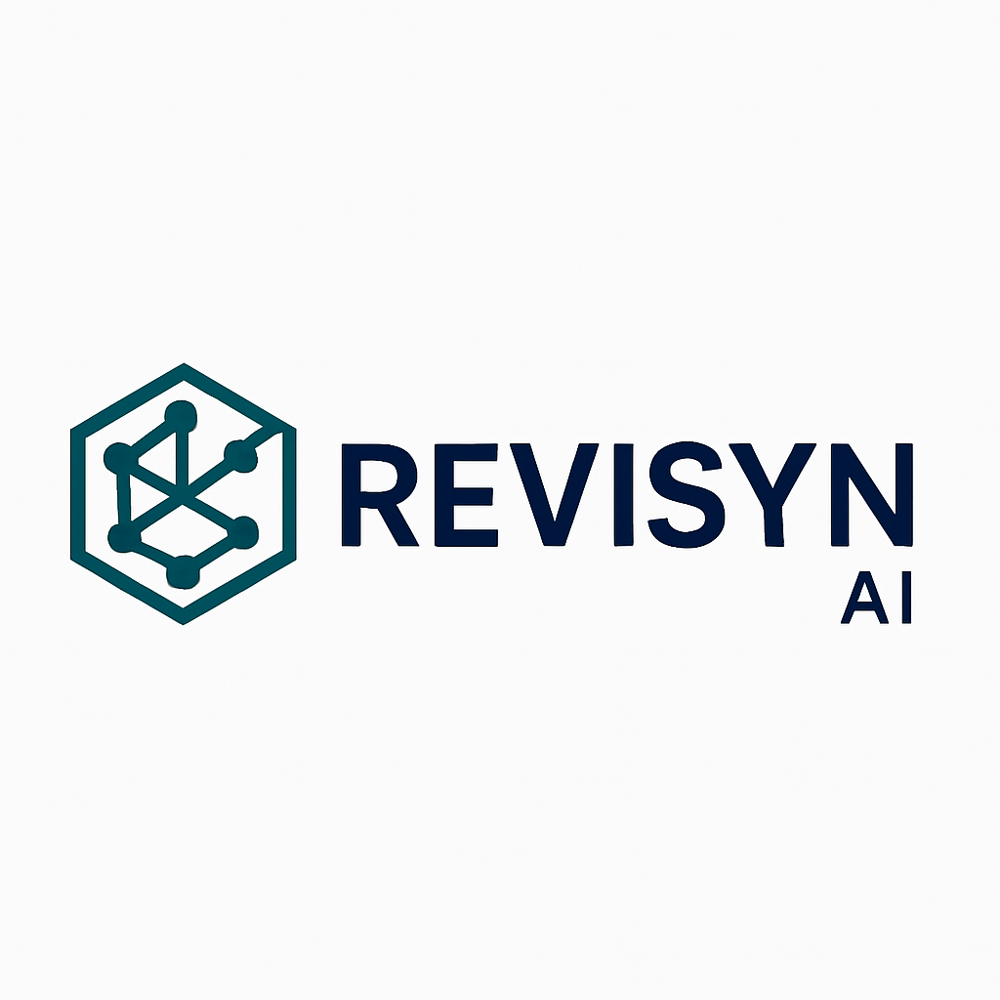

<p align="center">
  
</p>
<p align="center">
  <a href="https://github.com/awiones/Revisyn-Ai"></a>
  <a href="https://github.com/awiones/Revisyn-Ai"></a>
  <a href="https://github.com/awiones/Revisyn-Ai/blob/main/LICENSE"></a>
  
</p>

# Revisyn-AI

**Revisyn-AI** is an intelligent, AI-powered cybersecurity scanner. It helps security professionals and developers identify, analyze, and remediate web vulnerabilities with advanced AI models and automated techniques.

---

## 🚧 Beta Notice

> **Note:** Revisyn-AI is under active development and not yet feature-complete. Many features are experimental, and results may be incomplete or inaccurate. Feedback and contributions are welcome!

---

## ✨ Features

- **Automated Reconnaissance:**
  - Gathers information about target web applications (IPs, DNS, HTTP headers, technologies, and more).
- **Vulnerability Scanning:**
  - Checks for common web vulnerabilities: XSS, SQLi, LFI, open redirects, insecure headers, and more.
- **Web-Content Scanning:**
  - Discovers hidden directories and files using wordlist-based brute-forcing (see table below).
- **AI-Enhanced Analysis:**
  - Uses AI to analyze scan results, prioritize findings, and suggest remediation steps.
- **Flexible Output:**
  - Supports console, JSON, and HTML reporting.
- **Interactive CLI:**
  - Offers an interactive mode for step-by-step scanning and exploration.

---

## 🚀 Getting Started

1. **Install dependencies:**
   ```bash
   pip install -r requirements.txt
   ```
2. **Set up API keys:**
   - Use the following command to add your GitHub token (required for AI features):
     ```bash
     python main.py --auth github <your_github_token>
     ```
   - For Shodan or Censys, use:
     ```bash
     python main.py --auth SHODAN <your_shodan_api_key>
     python main.py --auth CENSYS-ID <your_censys_api_id>
     python main.py --auth CENSYS-SECRET <your_censys_api_secret>
     ```
3. **Run a scan:**
   ```bash
   python main.py -u https://target.com
   ```

---

## 🔍 Specifying Vulnerability Types

You can specify which vulnerabilities to scan for by providing a comma-separated list using the `-v` or `--vuln-types` parameter. Supported types are listed below:

| Type        | Description                                      |
| ----------- | ------------------------------------------------ |
| xss         | Cross-Site Scripting                             |
| sqli        | SQL Injection                                    |
| lfi         | Local File Inclusion                             |
| web_content | Web-Content Discovery (hidden files/directories) |

**Example:**

```bash
python main.py -u https://target.com -v xss,sqli,lfi
```

This command scans only for XSS, SQL Injection, and Local File Inclusion vulnerabilities on the target URL.

---

## 🗂️ Web-Content Scanning

Revisyn-AI can discover hidden directories and files using a wordlist-based brute-force approach. You can control the scan depth with the `-l` or `--level` parameter:

| Level    | Entries Scanned | Description                            |
| -------- | --------------- | -------------------------------------- |
| basic    | ~1,000          | Fast scan, checks most common paths    |
| standard | ~2,500          | Balanced scan, covers more directories |
| deep     | Full wordlist   | Thorough scan, may take longer         |

**Example:**

```bash
python main.py -u https://target.com -l deep -v web_content
```

This command performs a deep web content scan, discovering hidden files and directories.

---

## 📦 Output Formats

- **Console:** Human-readable output in the terminal (default)
- **JSON:** Machine-readable output for automation
- **HTML:** Beautiful, shareable reports

**Example:**

```bash
python main.py -u https://target.com -o html
```

---

## 💡 Interactive Mode

Launch an interactive CLI for step-by-step scanning:

```bash
python main.py -i
```

---

## ⚠️ Disclaimer

Revisyn-AI is for educational and authorized security testing only. **Do not use it against systems you do not own or have explicit permission to test.**

---

## 🤝 Contributing

Contributions, bug reports, and feature requests are welcome! Please open an issue or pull request on [GitHub](https://github.com/awiones/Revisyn-Ai).

---

## 📄 License

This project is licensed under the [MIT License](LICENSE).
